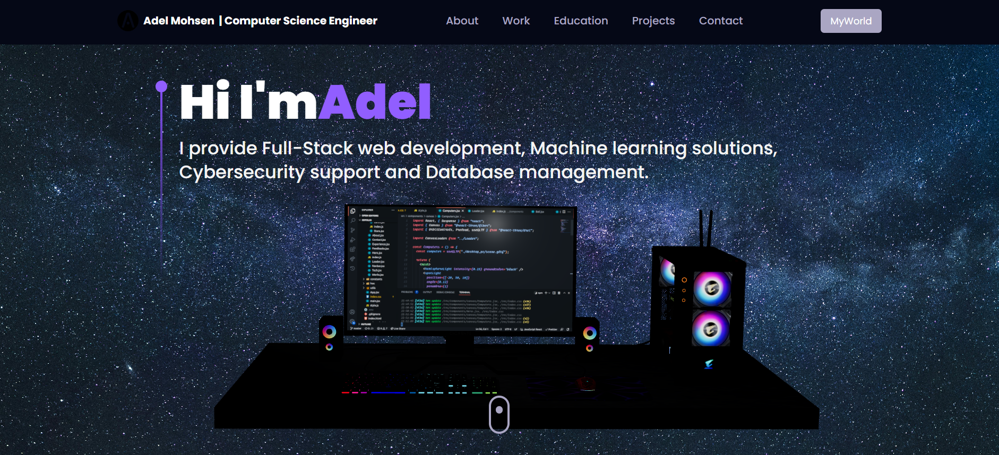
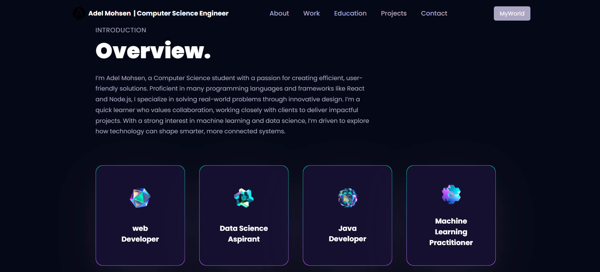
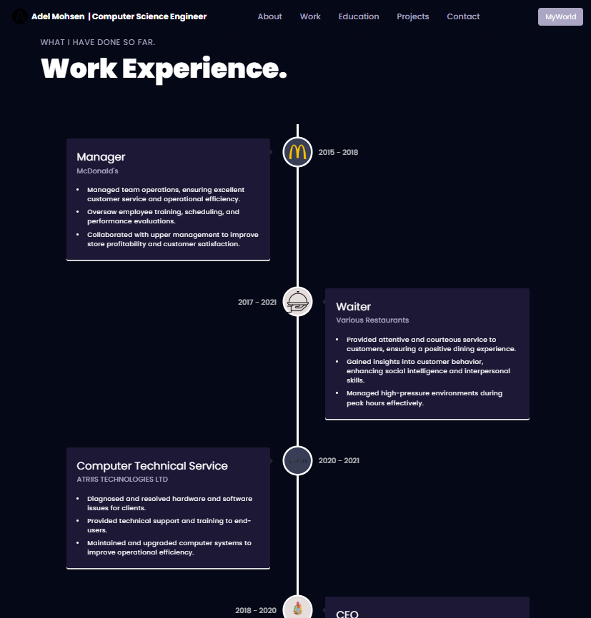
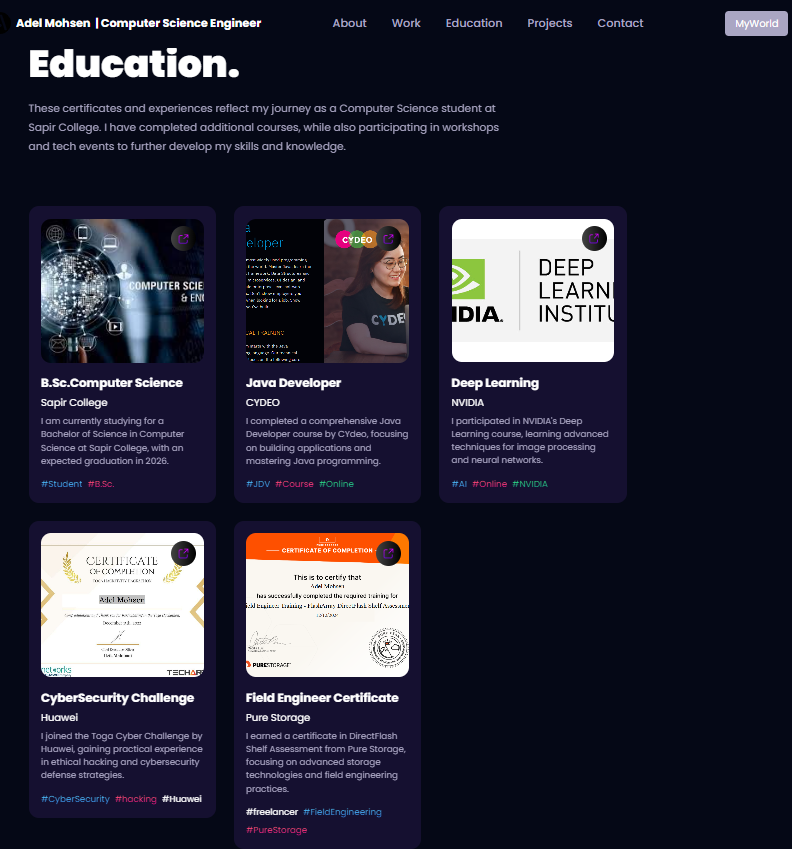
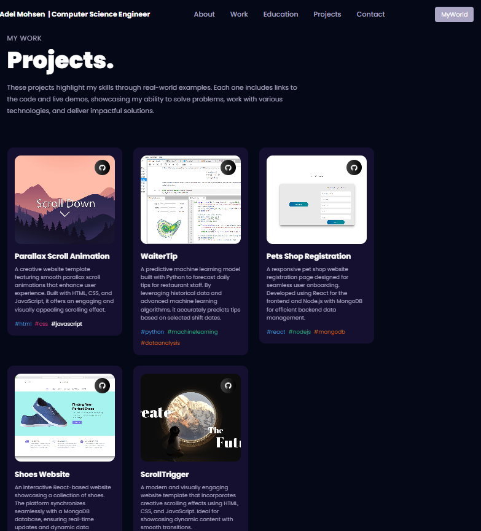
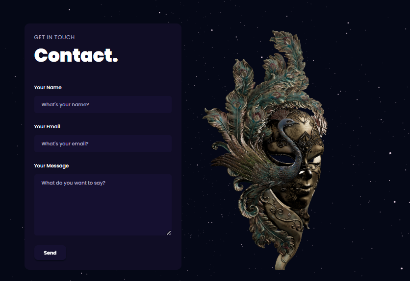
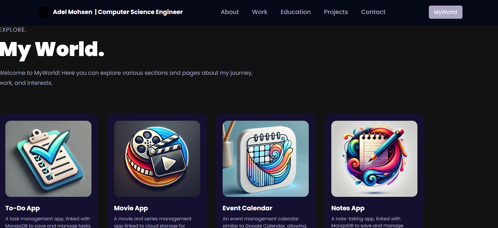

# Visit: [https://adel145.github.io/Adel_Portfolio-/](https://adel145.github.io/Adel_Portfolio-/)

## If the website is under construction, you can check out this YouTube video in the meantime:

[ Watch on YouTube](https://www.youtube.com/watch?v=NkZpJRHknQc)

---

### Below are 7 screenshots that showcase different sections of my portfolio website:

### Home Page section:

### Overview section:

### Work Experience section:

### Education section:

### Projects section:

### Contact section:

### myWorld Page :

