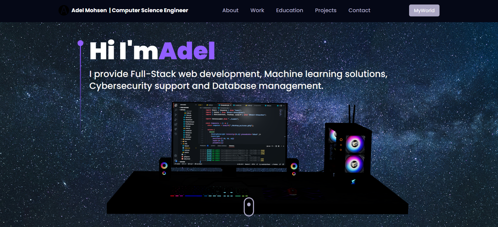

# Adel Mohsen | Full-Stack & AI Developer Portfolio

Live demo: https://adel145.github.io/Adel_Portfolio-/

Modern React/Vite portfolio for Adel Mohsen, B.Sc. Computer Science student at Sapir Academic College, expected graduation 07/2026. The site is focused on junior / entry-level full-stack, automation, data, and AI-powered apps roles.



## Career Focus

- Junior Full-Stack Developer
- Automation Developer
- Data / ML Engineer
- AI-Powered Apps Developer

CV PDF: https://adel145.github.io/Adel_Portfolio-/Adel-Mohsen-CV-Resume_2026_v1.pdf

Main project highlights:

- Miktsoan / Professional: final Computer Science full-stack AI capstone
- Crystallia: e-commerce, automation, and product operations project
- Tips Predictor: Python machine learning and data analysis project
- Portfolio Website: React, Vite, Tailwind, Framer Motion, and Three.js portfolio

## Tech Stack

- React 18 and Vite
- Tailwind CSS
- Framer Motion
- Three.js with React Three Fiber / Drei
- EmailJS with Vite environment variables
- GitHub Actions and GitHub Pages

## Features

- Dark technical visual identity with lightweight 3D sections
- HashRouter routing that works on GitHub Pages
- Static/client-only demo pages for ToDo, Notes, Calendar, and MovieApp
- Recruiter-friendly project cards with status badges, tech stacks, GitHub links, and live demo links where available
- SEO metadata and accessible form labels/buttons
- GitHub Actions deployment from `dist` artifact, without committing build output

## Performance Notes

- Removed committed `dist` files and duplicated original assets/backups from the source branch
- Removed backend-only and unused frontend dependencies from the Vite app
- Lazy-loaded major page sections and 3D canvas components
- Added a lightweight mobile fallback for the heaviest hero 3D model
- Converted backend-dependent demos to localStorage/static data so GitHub Pages has no broken API calls

## Local Setup

```bash
npm install
npm run dev
npm run build
npm run preview
```

EmailJS is optional. To enable the contact form locally or in deployment, copy `.env.example` to `.env` and fill in:

```bash
VITE_EMAILJS_SERVICE_ID=your_emailjs_service_id
VITE_EMAILJS_TEMPLATE_ID=your_emailjs_template_id
VITE_EMAILJS_PUBLIC_KEY=your_emailjs_public_key
```

Do not commit `.env`.

## GitHub Pages Deployment

This repository is configured for GitHub Pages at:

```js
base: "/Adel_Portfolio-/"
```

Deployment uses `.github/workflows/deploy.yml`.

Manual GitHub setting:

1. Open the repository on GitHub.
2. Go to Settings -> Pages.
3. Set Source to GitHub Actions.
4. Push to `main`.

GitHub Actions will install dependencies, build the Vite app, upload `dist`, and deploy it to GitHub Pages.

## Security

The live portfolio is static and does not depend on `server/server.js`.

The `server` folder is archived local demo code only. It no longer contains a real MongoDB URI. If any secret was previously committed or exposed, rotate it immediately in the original provider dashboard, including MongoDB credentials and EmailJS keys.
